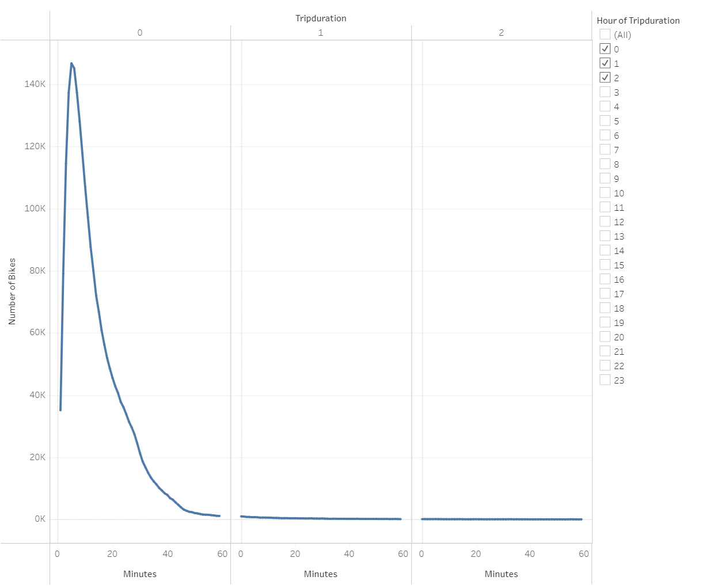
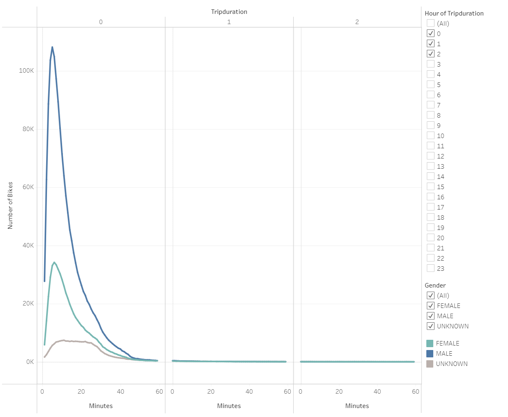
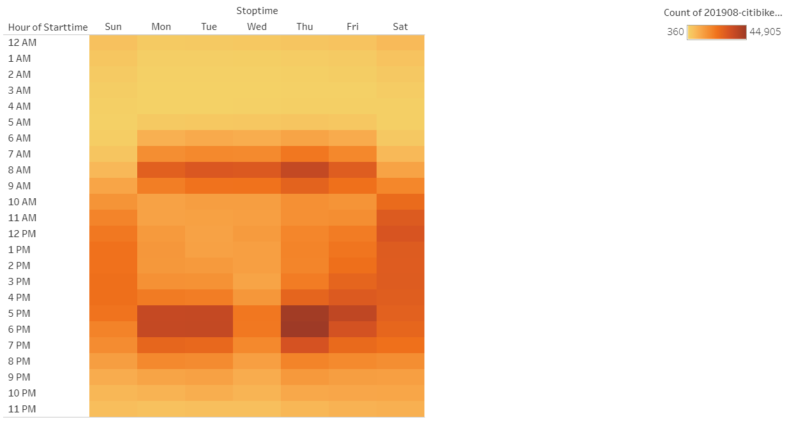
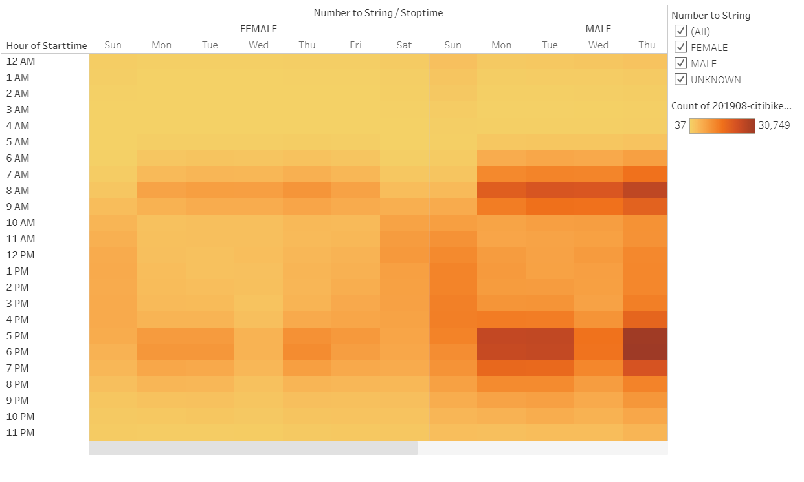
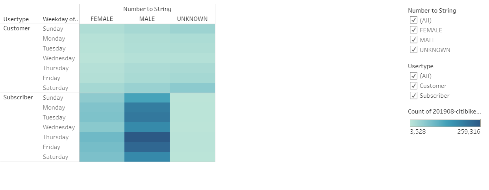
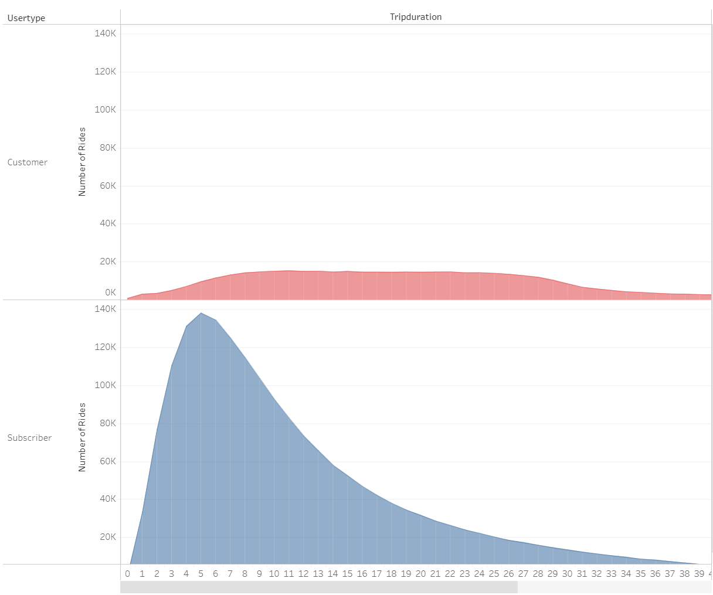

# bikesharing

## Project Overview  
Create data visuals with Tableau to analyze the bikesharing business model of Citibike in New York City. The data visuals will consist of seven analyses written out in storyboard.  

## Results  
1. Checkout Times for Users -Five minutes is the usual duration taken for a bike ride, however, trips can last up to over two hour.  
  
2. Checkout Times for Gender -Number of male riders outweight the number of female riders, however, both shown the same tend of trip durations with five minutes being the most common.  
  
3. Trips by Weekday per Hour -Heavier usage during 7am to 9am and 5pm to 7pm during the weekday. On the weekends, most usage occurs during the afternoon.  
  
4. Trips by Gender (Weeday per Hour) -Trends amongst both genders reveal to be the same usage throughout the week.  
  
5. Users Trips by Gender by Weekday -Thrusday and Friday are dominated by both female and male subscribers, while Saturday is the most popular day for both female and male customer user types.  
  
6. User Trips by Duration -Customer user types do not show a common ride duration as the counts range over 7 to 29 minutes. Subscribers commonly tend to take shorter durations between 2 to 12 minutes.  
  
7. User Breakdown by Gender -The majority of customer genders are unknown, however, male rides outweight females rides in both customer and subscriber user types.  
  

## Summary  
A Tableau story was designed to visualize the analyses and how the bike sharing business will operate. Actual numbers will vary from city to city depending on the population and tourist amount.  

[Tableau story](https://public.tableau.com/views/Challenge_16180779151220/NYCCitibikeAnalysis?:language=en&:display_count=y&publish=yes&:origin=viz_share_link)

